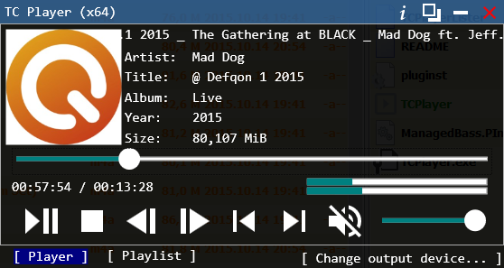
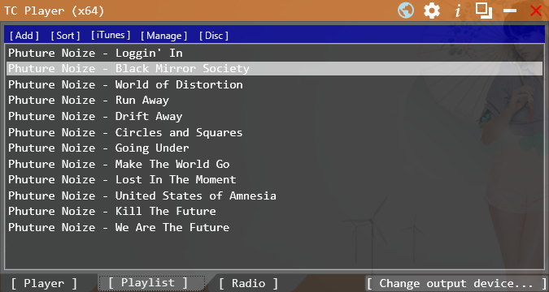
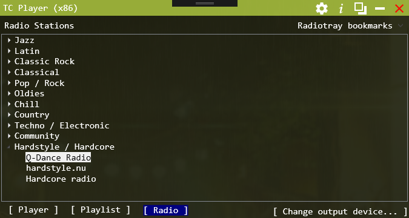

# TC Player

Total Commander Audio Player plugin & standalone player written in C#, based on bass.dll components.
Website: https://webmaster442.github.io/TCPlayer/

The software uses the following components made by others:

* [ManagedBass.PInvoke](https://github.com/ManagedBass/ManagedBass.PInvoke)
* [WPF Sound Visualization Library](http://wpfsvl.codeplex.com/)
* [TagLib#](https://github.com/mono/taglib-sharp)
* [mp4 chapters](https://mp4chap.codeplex.com/)
* [Material Design Icons](https://materialdesignicons.com/)
* [RadioTray's bookmarks](http://radiotray.sourceforge.net/)
* [Radiotray-hu bookmarks](https://github.com/gyarakilaszlo/Radiotray-hu)
* [WpfExpressionBlendTheme](https://github.com/DanPristupov/WpfExpressionBlendTheme)

Code compiles with Visual Studio Community 2017. For the Total commander plugins C++ workload is required, for the player c# workload is required.

## Features

* Supports various audio formats: MP3, MP4, AAC, OGG, WAV, FLAC, WavPack, Apple Lossless (ALAC), WMA, AC3, CDDA, APE, MPC, MP+, MPP, SPX, TTA, DSF, OPUS
* Support MIDI & tracker files playback: midi, mid, rmi, kar, xm, it, s3m, mod, mtm, umx, .mo3
* Supports various playlist formats: PLS, M3U, WPL, ASX
* Supports URL playback
* 64 bit & 32 bit support
* Supports Windows 7 & 8 Shell features: Taskbar progress & Taskbar preview buttons
* Supports multimedia keys
* Supports MP4 chapters
* Notifications on track change

## Requirements to run
 - Windows 7/8/8.1/10
 - Total commander for the plugin install (tested with 8.51a x64)
 - .NET Framework 4.7 (As of version 2.1)
   http://www.microsoft.com/hu-hu/download/details.aspx?id=30653
 - For MIDI playback a soundfont is needed. For starters you could use the default soundfont provided with the Bass midi component: http://www.un4seen.com/download.php?x/ChoriumRevA

   
## License

This program is free software: you can redistribute it and/or modify it under the terms of the GNU General Public License as published by the Free Software Foundation, either version 3 of the License, or (at your option) any later version.

This program is distributed in the hope that it will be useful, but WITHOUT ANY WARRANTY; without even the implied warranty of MERCHANTABILITY or FITNESS FOR A PARTICULAR PURPOSE.  See the GNU General Public License for more details.

You should have received a copy of the GNU General Public License along with this program.  If not, see http://www.gnu.org/licenses/

For the Bass.dll License please visit http://www.un4seen.com/bass.html#license